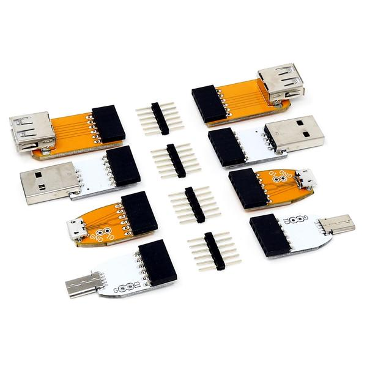

# USB_cable_tester
A basic USB cable tester using an arduino and the [Pi Hut USB Adapter Kit](https://thepihut.com/products/usb-adapter-kit)  

Is my USB cable dead?  
Is my USB cable only for charging?  

To be sure test it.  

The USB Adapter Kit from The Pi Hut offers a full line of USB connectors male and female, each one soldered on a board with 100 mil square pins on the other side.  

This tester uses the kit in order to test any USB cable with any combination of USB connectors.  
The Arduino applies a HIGH or a LOW on each pin of the two connectors in turn and reads the pins of the opposite connector.  
The result of the scan is displayed on the serial console or any serial terminal application.  

Note, only VBUS, D+, D- and GND are tested.
